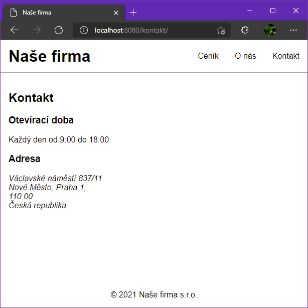
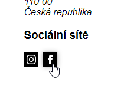

# Eleventy

## Zadání

- Spusť si tento projekt postavený na [Eleventy](https://www.11ty.dev/).

  ### Instalace závislostí

  `npm install`

  ### Produkční sestavení

  `npm run build`

  ### Vývojové sestavení

  `npm run dev`

- Koukni do prohlížeče, že se ti stránka při vývojovém sestavení načte.

  - Zkontroluj, že se proklikneš na všechny tři podstránky (úvodní, ceník, o nás).

  - Na úvodní stránce by měl být obrázek.

  - Všechny stránky by měly být drobně nastylované.

- Přidej další podstránku `Kontakt`.

  - Do zdrojové složky `src` přidej soubor `kontakt.njk`. Můžeš se inspirovat podle `o-nas.njk`. Pro obsah použij následující HTML:

    ```html
    <h2>Kontakt</h2>

    <h3>Otevírací doba</h3>

    <p>Každý den od 9:00 do 18:00.</p>

    <h3>Adresa</h3>

    <address>
    	Václavské náměstí 837/11<br />
    	Nové Město, Praha 1,<br />
    	110 00<br />
    	Česká republika
    </address>
    ```

  - Odkaz na kontakt přidej do společné navigace v hlavičce.

  - Výsledek by měl vypadat takto:

    

## Bonus

- Doplň do kontaktní stránky odkazy na sociální sítě.

  - Do složky `src/obrazky` stáhni ikonku [Instagramu](https://iconmonstr.com/instagram-12-svg/) a [Facebooku](https://iconmonstr.com/facebook-2-svg/).

  - Nachystej si soubor `src/casti/socialni-site.njk` podle předlohy.

    ```html
    <section class="socialni-site">
    	<a class="socialni-site__instagram" href="https://www.instagram.com/">
    		
    	</a>
    	<a class="socialni-site__facebook" href="https://www.facebook.com/">
    		
    	</a>
    </section>
    ```

  - Nachystanou komponentu zapoj pod adresu na kontaktní stránce.

    ```njk
    <h3>Sociální sítě</h3>

    
    ```

  - Dostyluj komponentu `socialni-site` tak, aby ikonky měly mezi sebou mezeru `0.5rem`. Na hover/focus jim přidej stín `box-shadow: 0 0 0.5rem rgba(#000000, 0.4)`. Styly piš do souboru `src/styly/komponenty/socialni-site.scss`. Nezapomeň na import v `index.scss`.

  - Výsledek by měl vypadat takto:

    

- Proveď produční sestavení a výslednou stránku ve složce `dist` vystav na [Netlify Drop](https://app.netlify.com/drop).
